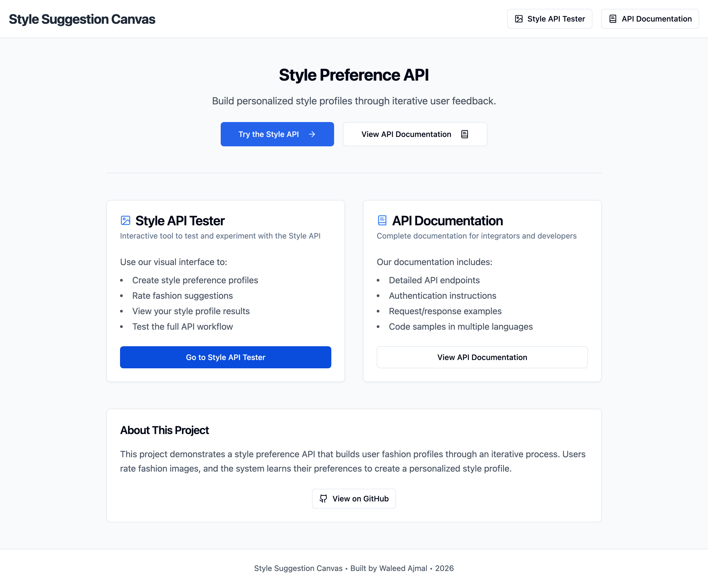
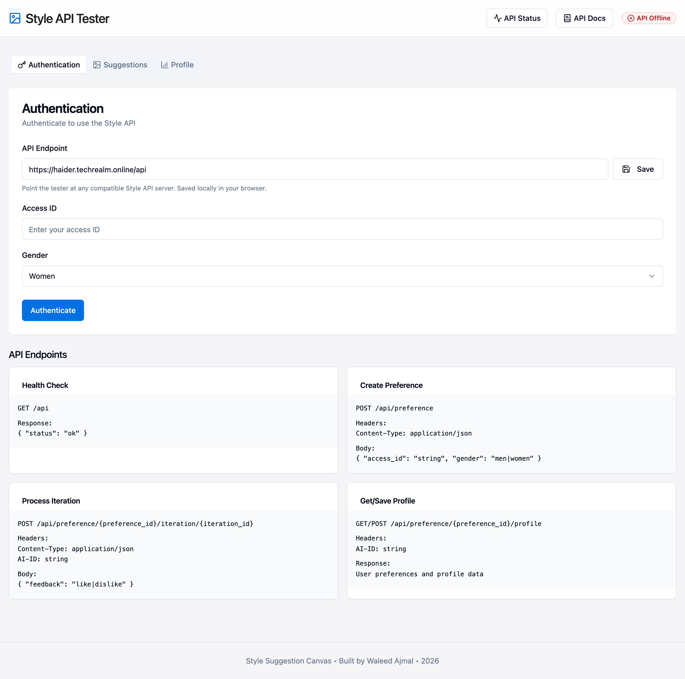
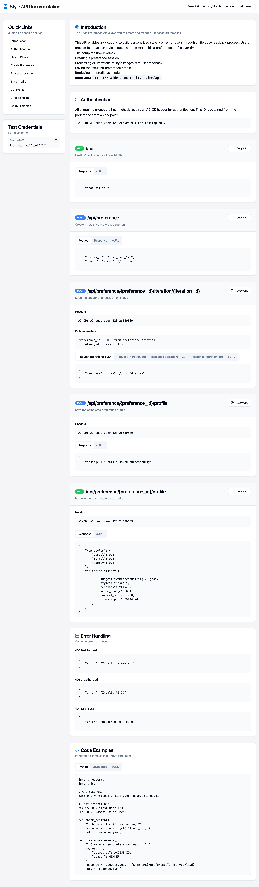
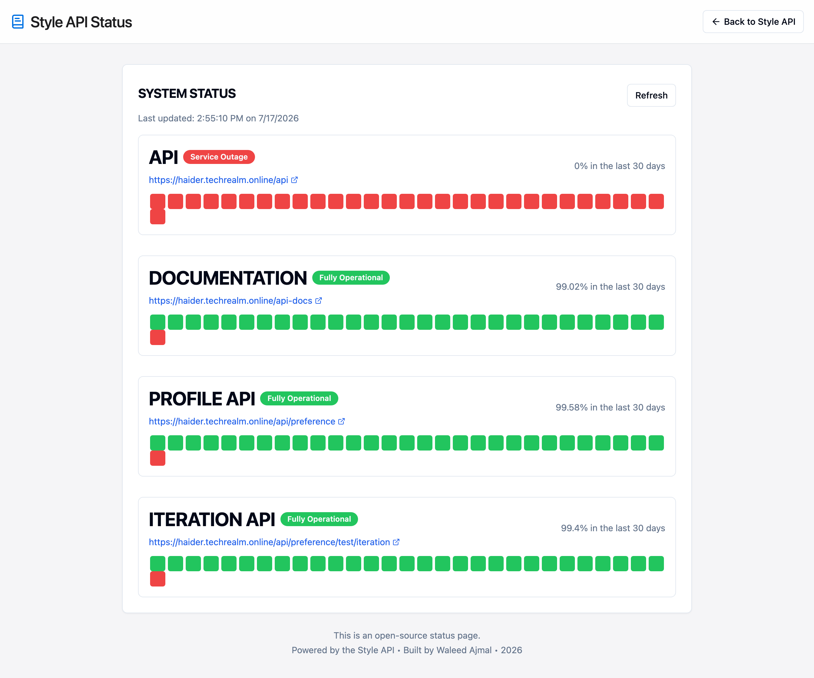
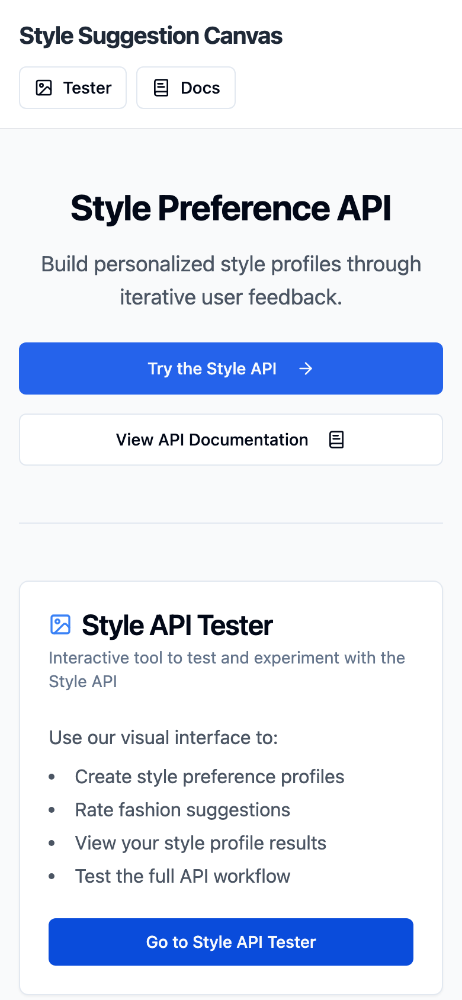
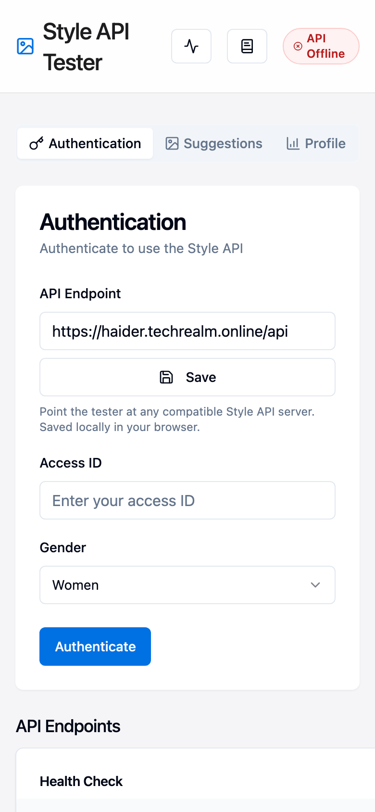

# Style Suggestion Canvas 🎨

A hands-on **playground for the Style Preference API** — the little API that learns what you
*actually* like by watching you swipe through outfits. Point it at a running Style API server,
authenticate, rate a stream of fashion images with a simple like / dislike, and watch a
personalized style profile take shape in real time.

Think of it as a REST client that happens to have great taste.

> Built with React + Vite + TypeScript + Tailwind + shadcn/ui. No backend of its own — it's a
> pure front-end tester that talks to any compatible Style API endpoint.

---

## ✨ What it does

- **🔐 Authentication tab** — spin up a session against the API with an access ID and a gender preset.
- **🖼️ Suggestions tab** — the heart of it: get an outfit, hit 👍 or 👎, and the API serves the next
  one, iterating up to 30 rounds while it quietly learns your taste.
- **📊 Profile tab** — a live chart of your top styles plus a full selection history (what you saw,
  what you picked, and how each choice nudged your score).
- **🔌 Configurable API endpoint** — a built-in field lets you point the tester at any compatible
  Style API server (production, staging, or a local mock). Your choice is remembered in the browser.
- **📚 API Documentation page** — every endpoint laid out with copy-paste `curl`, Python, and
  JavaScript snippets, so integrators can get going in minutes.
- **🩺 API Status page** — a quick health board that pings the core endpoints and shows what's up.
- **📱 Fully responsive** — from a wide desktop dashboard down to a one-thumb mobile layout.

---

## 🖥️ A look around

### Home


### Style API Tester


### API Documentation


### API Status board


### Mobile
It folds down neatly for small screens too:

<p>
  
  &nbsp;
  
</p>

---

## 🚀 Getting started (from zero)

New to Node? No worries — here's the whole thing, copy-paste-able.

### 1. Prerequisites

You need **Node.js 18 or newer** and **npm** (npm ships with Node). Check what you've got:

```bash
node -v   # should print v18.x or higher
npm -v
```

Don't have Node? The friendliest way to install it is with **nvm**:

```bash
# install nvm (macOS / Linux)
curl -o- https://raw.githubusercontent.com/nvm-sh/nvm/v0.39.7/install.sh | bash
# restart your terminal, then:
nvm install 20
nvm use 20
```

On Windows, grab the LTS installer from [nodejs.org](https://nodejs.org/) instead.

### 2. Clone & install

```bash
git clone https://github.com/waleedsworld/style-suggestion-canvas.git
cd style-suggestion-canvas
npm install
```

### 3. Run the dev server

```bash
npm run dev
```

Vite will print a local URL (usually **http://localhost:8080**). Open it and you're in. 🎉
The dev server hot-reloads, so edits show up instantly.

### 4. Build for production

```bash
npm run build     # outputs a static bundle to dist/
npm run preview   # serve the built bundle locally to sanity-check it
```

Because the output is fully static, you can host `dist/` anywhere — Cloudflare Pages, Netlify,
GitHub Pages, an S3 bucket, or your own box.

---

## 🔧 Pointing it at your own API

By default the tester talks to a hosted Style API. To use a different server, just open the
**Style API Tester → Authentication** tab and change the **API Endpoint** field, then hit **Save**.
The value is stored in `localStorage`, so it sticks between visits — no rebuild needed.

The API contract, in a nutshell:

| Method | Path | What it does |
| ------ | ---- | ------------ |
| `GET`  | `/api` | Health check |
| `POST` | `/api/preference` | Create a session (`access_id`, `gender`) |
| `POST` | `/api/preference/{id}/iteration/{n}` | Submit `like`/`dislike`, get the next image |
| `GET`  | `/api/preference/{id}/profile` | Fetch the learned style profile |
| `POST` | `/api/preference/{id}/profile` | Persist the profile |

The in-app **API Documentation** page has the full request/response details and ready-to-run snippets.

---

## 🧱 Tech stack

- **Vite** — lightning-fast dev server & bundler
- **React 18** + **TypeScript** — typed, component-driven UI
- **Tailwind CSS** + **shadcn/ui** (Radix primitives) — the design system
- **React Router** — client-side routing across the four pages
- **TanStack Query** — data/query plumbing
- **Recharts** — the style-profile visualizations
- **Sonner** — the toast notifications

---

## 📁 Project layout

```
src/
├── components/          # ImageCard, PreferenceChart, ApiStatusIndicator, ui/ (shadcn)
├── hooks/               # use-mobile, use-toast
├── pages/               # Index, StyleAPI, ApiDocs, ApiStatus, NotFound
├── services/
│   └── StyleApiClient.ts  # all the API calls + session/iteration bookkeeping
└── main.tsx
```

`StyleApiClient.ts` is where the interesting logic lives: session persistence, iteration counting,
and graceful handling of the "no more images" / "invalid iteration" edge cases.

---

## 🌐 Live demo

Live demo — deploying soon.

---

## 📜 License

Released under the MIT License. Style responsibly. 😉
