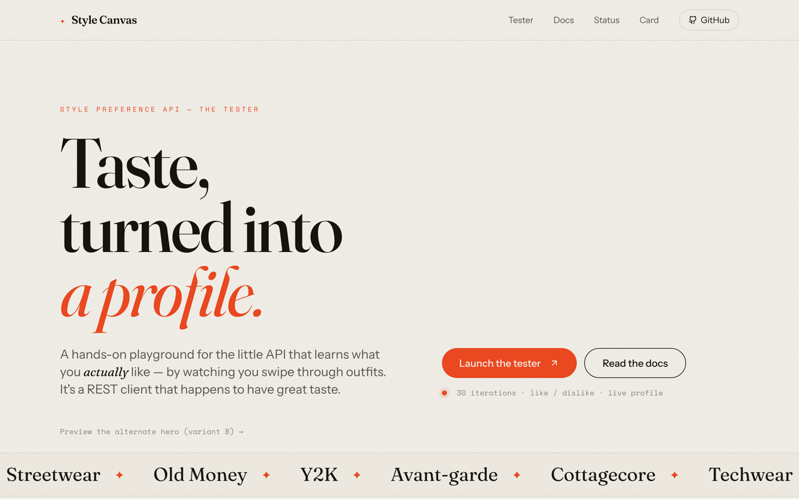
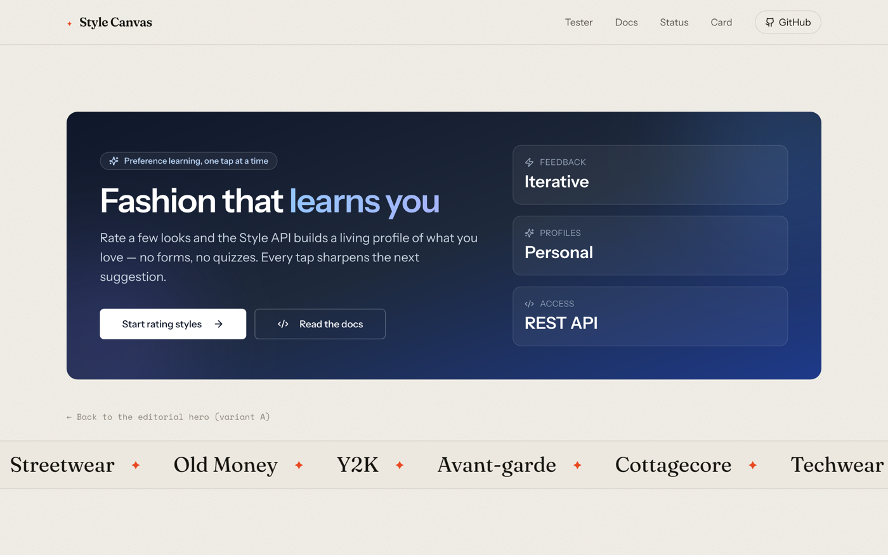
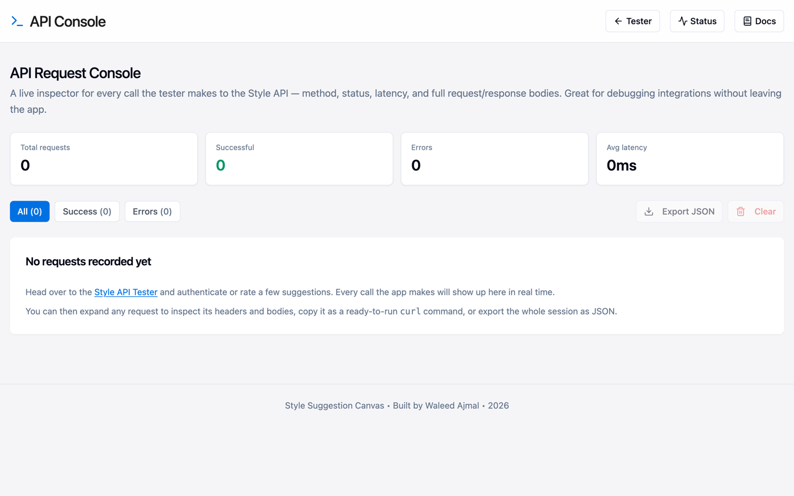
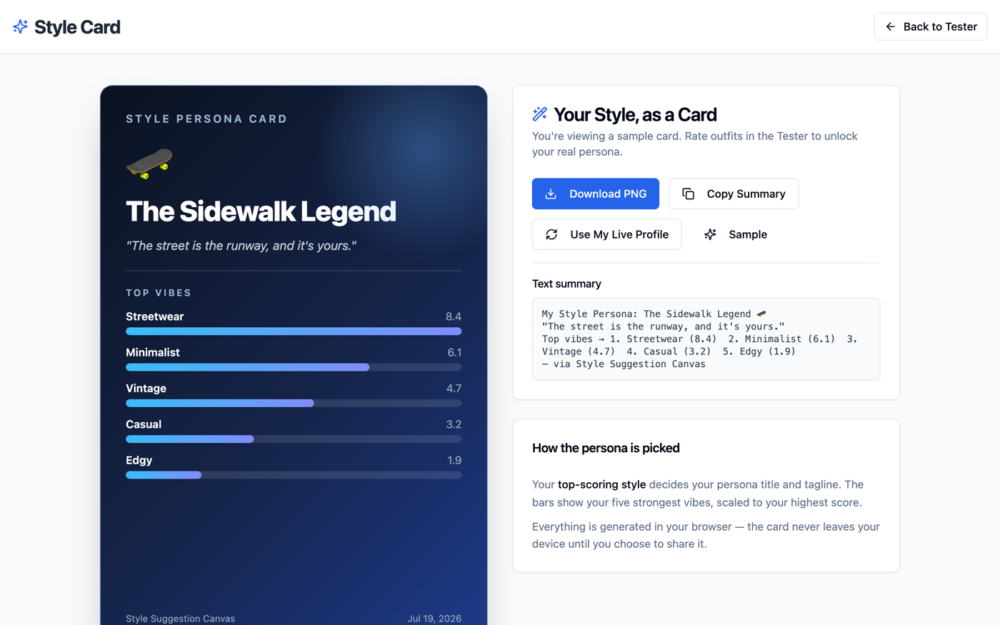
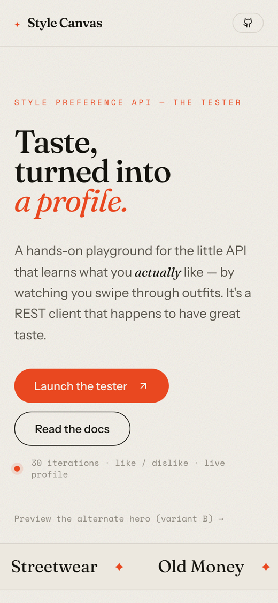

# Style Suggestion Canvas 🎨

<p>
  <a href="https://ethos.techrealm.online"></a>
  
  
  
  
  
  
</p>

> ### Taste, turned into a profile.
> A hands-on **playground for the Style Preference API** — the little API that learns what you *actually* like by watching you swipe through outfits. It's a REST client that happens to have great taste.
>
> **Live → [ethos.techrealm.online](https://ethos.techrealm.online)**

<p align="center">
  
</p>

Point it at a running Style API server, authenticate, rate a stream of fashion images with a simple 👍 / 👎, and watch a personalized style profile take shape in real time. No backend of its own — it's a pure front-end tester that talks to any compatible Style API endpoint.

---

## ✨ What's new in this release

This round was a top-to-bottom glow-up. The headline acts:

- **🖤 A brand-new editorial landing page** — a fashion-magazine aesthetic with a Fraunces display serif, warm bone paper, a vermilion accent, an animated style-word marquee, and staggered reveal-on-load. It's the first thing people see, and now it dresses the part.
- **🖥️ API Console** *(new)* — a live request inspector that records **every** call the tester makes to the Style API (method, status, latency, full request/response bodies). Expand any request to copy it as a ready-to-run `curl`, filter by success/error, and export the whole session as JSON. No browser devtools required.
- **🪪 Style Card** *(new)* — turn a finished profile into a poster-worthy, shareable summary of someone's taste, ready to export and show off.
- **🧪 A/B landing heroes** *(new)* — two interchangeable hero treatments, switchable live with `?variant=b`, so you can test messaging without a rebuild.
- **♿ Accessibility & performance pass** — skip-to-content link, visible keyboard focus rings, honest `aria-label`s, `prefers-reduced-motion` support, and **route-level code splitting** so the landing page paints fast and the heavy pages load on demand.
- **🛡️ Robustness pass** — friendlier error and empty states across the tester, docs, status, and 404 pages.
- **✅ A real test suite** — 31 unit tests (Vitest + Testing Library) plus a Playwright smoke spec and a GitHub Actions CI workflow.
- **🔎 SEO & PWA polish** — Open Graph / Twitter cards, structured data, a web manifest with icons, `robots.txt`, a sitemap, and SPA routing that survives a hard refresh.

---

## 🖥️ A look around

### The editorial landing (light & dark)

<p>
  
  &nbsp;
  
</p>

### A/B hero — `variant B`

Append `?variant=b` for a dark, split-layout "Fashion that learns you" hero:



### API Console — inspect every request



### Style Card — share your taste



### Mobile

It folds down neatly for one-thumb use, too:

<p>
  
</p>

---

## 🧪 Landing hero A/B variants

The home page has two interchangeable hero treatments for testing messaging and layout — no rebuild required:

- **`/`** or **`/?variant=a`** — the editorial "Taste, turned into a profile." hero (default).
- **`/?variant=b`** — a dark, split-layout "Fashion that learns you" hero with an action-first CTA and a stat strip.

Your choice sticks in the browser (`localStorage`), and a link under the hero flips between them. Full details in [`docs/LANDING_VARIANTS.md`](docs/LANDING_VARIANTS.md).

---

## 🚀 Getting started (from zero)

**In a hurry?** One line, assuming you already have Node 18+:

```bash
git clone https://github.com/waleedsworld/style-suggestion-canvas.git && cd style-suggestion-canvas && npm install && npm run dev
```

New to Node? No worries — here's the whole thing, copy-paste-able.

### 1. Prerequisites

You need **Node.js 18 or newer** and **npm** (npm ships with Node). Check what you've got:

```bash
node -v   # should print v18.x or higher
npm -v
```

Don't have Node? The friendliest way to install it is with **nvm**:

```bash
# install nvm (macOS / Linux)
curl -o- https://raw.githubusercontent.com/nvm-sh/nvm/v0.39.7/install.sh | bash
# restart your terminal, then:
nvm install 20
nvm use 20
```

On Windows, grab the LTS installer from [nodejs.org](https://nodejs.org/) instead.

### 2. Clone & install

```bash
git clone https://github.com/waleedsworld/style-suggestion-canvas.git
cd style-suggestion-canvas
npm install
```

### 3. Run the dev server

```bash
npm run dev
```

Vite will print a local URL (usually **http://localhost:8080**). Open it and you're in. 🎉 The dev server hot-reloads, so edits show up instantly.

### 4. Build & test

```bash
npm run build     # outputs a static bundle to dist/
npm run preview   # serve the built bundle locally to sanity-check it
npm test          # run the Vitest unit suite
npm run test:e2e  # run the Playwright smoke test (needs a preview server)
```

Because the output is fully static, you can host `dist/` anywhere — Cloudflare Pages, Netlify, GitHub Pages, an S3 bucket, or your own box.

---

## 🔧 Pointing it at your own API

By default the tester talks to a hosted Style API. To use a different server, open the **Style API Tester → Authentication** tab and change the **API Endpoint** field, then hit **Save**. The value is stored in `localStorage`, so it sticks between visits — no rebuild needed.

The API contract, in a nutshell:

| Method | Path | What it does |
| ------ | ---- | ------------ |
| `GET`  | `/api` | Health check |
| `POST` | `/api/preference` | Create a session (`access_id`, `gender`) |
| `POST` | `/api/preference/{id}/iteration/{n}` | Submit `like`/`dislike`, get the next image |
| `GET`  | `/api/preference/{id}/profile` | Fetch the learned style profile |
| `POST` | `/api/preference/{id}/profile` | Persist the profile |

The in-app **API Documentation** page has the full request/response details and ready-to-run snippets — and the **API Console** shows every one of these calls as it happens.

---

## 🧱 Tech stack

- **Vite** — lightning-fast dev server & bundler
- **React 18** + **TypeScript** — typed, component-driven UI
- **Tailwind CSS** + **shadcn/ui** (Radix primitives) — the design system
- **React Router** (with lazy routes) — client-side routing and code splitting
- **TanStack Query** — data/query plumbing
- **Recharts** — the style-profile visualizations
- **Sonner** — the toast notifications
- **Vitest** + **Testing Library** + **Playwright** — the test suite

---

## 📁 Project layout

```
src/
├── components/          # ImageCard, PreferenceChart, HeroVariantB, ApiStatusIndicator, ui/ (shadcn)
├── hooks/               # use-mobile, use-toast, use-variant, useApiLog
├── pages/               # Index, StyleAPI, ApiDocs, ApiStatus, ApiConsole, StyleCard, NotFound
├── services/
│   ├── StyleApiClient.ts  # all the API calls + session/iteration bookkeeping
│   └── apiLog.ts          # the request-log store that powers the API Console
└── main.tsx
e2e/                     # Playwright smoke test
docs/                    # TESTING.md, LANDING_VARIANTS.md, media/
```

`StyleApiClient.ts` is where the interesting logic lives: session persistence, iteration counting, and graceful handling of the "no more images" / "invalid iteration" edge cases. Every request it makes is piped through `apiLog.ts`, which is what the API Console renders.

---

## ✅ Testing

```bash
npm test            # Vitest unit + component tests (jsdom)
npm run test:coverage
npm run test:e2e    # Playwright end-to-end smoke test
```

Details and conventions live in [`docs/TESTING.md`](docs/TESTING.md). CI runs the unit suite and a production build on every push (see `.github/workflows/ci.yml`).

---

## 🌐 Live demo

It's live at **[ethos.techrealm.online](https://ethos.techrealm.online)** — no install required, just open it and start rating outfits. The tester ships pointed at a hosted Style API, so it works out of the box; swap in your own endpoint any time from the **Authentication** tab.

---

## 📜 License

Released under the MIT License. Style responsibly. 😉
